# :page_with_curl: Docker基础

## 一、Docker概要

### 1.1  Docker为什么会出现？

### 1.2  Docker相应材料

​	官方地址：https://www.docker.com/

 	文档地址：https://docs.docker.com/

​	仓库地址：https://www.docker.com/products/docker-hub

### 1.3 Docker与虚拟机的比较

- 传统虚拟机虚拟出一条硬件，运行一个完整的操作系统，然后在这个系统上安装和运行软件
- 容器内的应用直接运行在宿主机内核，容器自己没有内核，也没有虚拟相应的硬件，所以更轻便
- 每个容器间是相互隔离，每个容器内都有一个属于自己的文件系统，互不影响

### 1.4 Docker优势

- 应用更快速的交付和部署
- 更便捷的升级和扩容
- 更简单的系统运维
- 更高效的计算资源利用

### 1.5 Docker中的名称概念

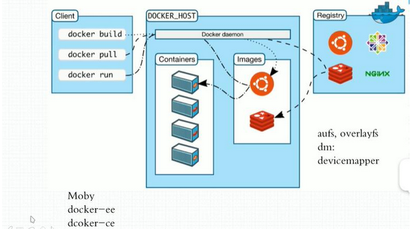

1、镜像（Image）

​	docker镜像好比一个模板，可以通过这个模板来创建一个容器服务

2、容器(Container)

​	Docker通过容器技术，独立运行一个或者一组应用，通过镜像来创建的

3、仓库(Repository)

​	仓库就是存放镜像的地方

## 二、Docker安装

### 1.1 安装文档

文档地址：https://docs.docker.com/engine/install

根据要安装的系统查看相应的安装说明

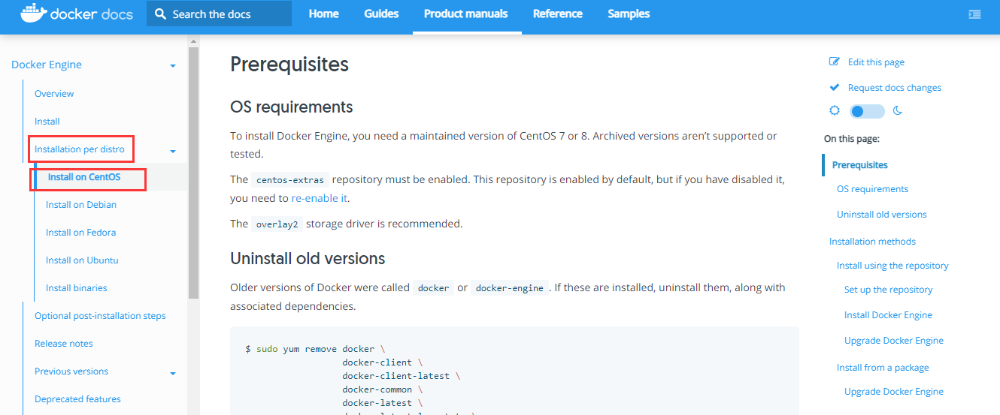

### 1.2 安装步骤

1、卸载旧的版本

~~~shell
yum remove docker \
                  docker-client \
                  docker-client-latest \
                  docker-common \
                  docker-latest \
                  docker-latest-logrotate \
                  docker-logrotate \
                  docker-engine
~~~

2、安装需要的安装包

~~~shell
yum install -y yum-utils
~~~

3、设置镜像仓库

~~~shell
# 国外镜像地址
yum-config-manager \
    --add-repo \
    https://download.docker.com/linux/centos/docker-ce.repo 

# 阿里云镜像地址
yum-config-manager --add-repo   http://mirrors.aliyun.com/docker-ce/linux/centos/docker-ce.repo
~~~

4、安装yum软件索引

~~~ shell
yum makecache fast
~~~

5、安装Docker引擎

~~~ shell
# docker-ce：是指社区版（**官方推荐使用**）  docker-ee：指企业版
yum install docker-ce docker-ce-cli containerd.io
~~~

6、启动Docker

~~~shell
systemctl start docker
~~~

7、查看Docker信息

~~~ shell
docker version
~~~

8、运行Hello World

~~~shell
docker run hello-world
~~~

​		如果程序不存在会自动下载hello-word的镜像，然后在执行

9、删除Docker

~~~shell
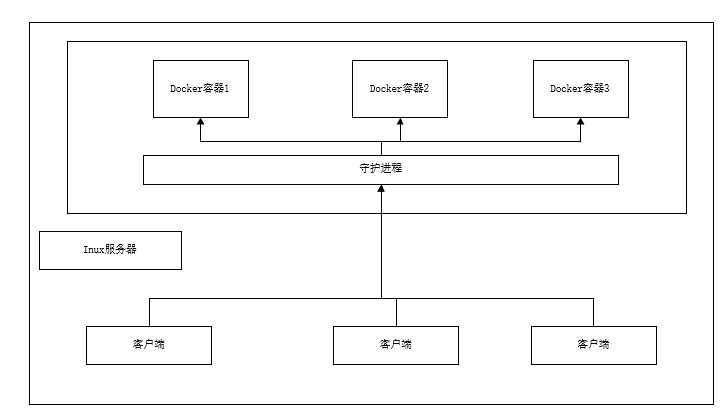# 1、删除Docker服务
yum remove docker-ce docker-ce-cli containerd.io

# 2、删除相应的文件
rm -rf /var/lib/docker
rm -rf /var/lib/containerd

# /var/lib/docker为Docker默认的工作路径
~~~

### 1.3 Docker工作原理

1、Docker如何工作

​	Docker是一个Client-Server结构的系统，Docker守护进程运行在主机上，通过Socket从客户端访问；DockerServer接收到DockerClient的指令，就会执行这个命令。

2、Docker比Vm更快

- Docker有着比虚拟机更少的抽象层；
- Docker利用的宿主机的内核，Vm需要Guest OS；Docker不需要像虚拟机一样重新加载一个操作系统内核。

## 三、 Docker命令

### 3.1 帮助命令：

~~~ shell
docker version        # 显示docker的版本信息
docker info           # 显示docker的系统信息，包括镜像和容器的数量
docker --help         # 帮助命令
~~~

​	帮助文档地址：https://docs.docker.com/reference/

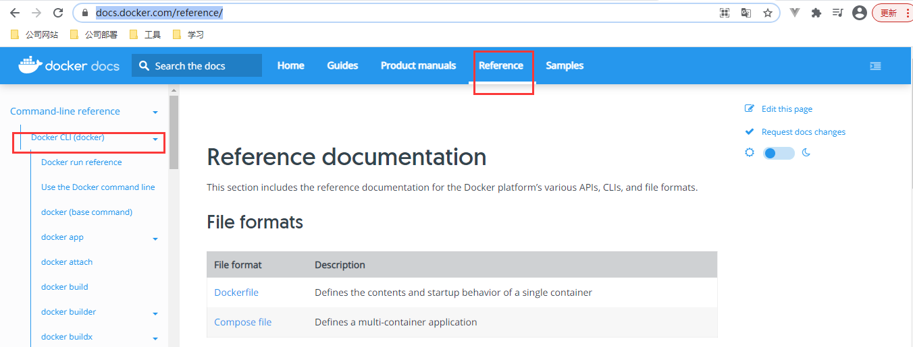

### 3.2 镜像命令

**docker images ** 查看本地Docker镜像

~~~shell
root@192.168.56.101:~# docker images
REPOSITORY    TAG       IMAGE ID       CREATED        SIZE
hello-world   latest    d1165f221234   2 months ago   13.3kB
解释：
REPOSITORY  镜像的仓库源
TAG         镜像的版本
IMAGE ID    镜像的ID
SIZE        镜像大小
其他参数:
  -a, --all             # 显示所有镜像
  -q, --quiet           # 显示镜像ID
# 示例
root@192.168.56.101:~# docker images -q
d1165f221234

显示所有镜像的ID
root@192.168.56.101:~# docker images -aq
d1165f221234
~~~

**docker search**  搜索Docker镜像

~~~shell
root@192.168.56.101:~# docker search mysql
NAME                              DESCRIPTION                                     STARS     OFFICIAL   AUTOMATED
mysql                             MySQL is a widely used, open-source relation…   10842     [OK]       
mariadb                           MariaDB Server is a high performing open sou…   4091      [OK]       

参数：
-f, --filter   # 过滤镜像条件

示例：（查询Mysql的STARS值大于3000的镜像）
root@192.168.56.101:~# docker search mysql --filter=STARS=3000
NAME      DESCRIPTION                                     STARS     OFFICIAL   AUTOMATED
mysql     MySQL is a widely used, open-source relation…   10842     [OK]       
mariadb   MariaDB Server is a high performing open sou…   4091      [OK] 
~~~

**Docker pull** 下载镜像

~~~shell
# 下载镜像 docker pull 镜像名[:tar]
root@192.168.56.101:~# docker pull mysql

root@192.168.56.101:~# docker pull ./io/library/mysql:last
~~~

**Docker rmi** 删除镜像

~~~shell
删除单个镜像
root@192.168.56.101:~# docker rmi 镜像ID
删除多个镜像
root@192.168.56.101:~# docker rmi 镜像ID 镜像ID 镜像ID
删除所有镜像
root@192.168.56.101:~# docker rmi $(docker images -aq)
~~~

### 3.3 容器命令

​	说明：镜像必须运行后才会有容器

1、新建容器并启动

~~~shell
docker run [可选参数] image
# 参数说明
--name="Name"        容器名字  tomcat1 tomcat2,用来区分容器
-d                   后台执行
-it                  使用交互方式运行，进入容器查看内容
-p                   指定容器的端口
       -p  ip:主机端口映射:容器端口
       -p  主机端口:容器端口（常用）
       -p  容器端口
-P(大写)                   指定随意端口
测试：
# 启动并进入到docker容器（/bin/bash是容器的控制台）
root@192.168.56.101:~# docker run -it centos /bin/bash
[root@7bb0b0f0c05a /]# ls   # 查看容器内的centos
bin  dev  etc  home  lib  lib64  lost+found  media  mnt  opt  proc  root  run  sbin  srv  sys  tmp  usr  var

# 退出容器
[root@7bb0b0f0c05a /]# exit
exit

~~~

2、查看所有运行的容器

~~~shell
# docker ps 命令
		# 列出所有运行的容器
-a  	# 列出当前运行和历史运行的容器
-n=? 	# 显示最近创建的容器,n表示显示的个数
-q      # 显示容器的编号

root@192.168.56.101:~# docker ps
CONTAINER ID   IMAGE     COMMAND   CREATED   STATUS    PORTS     NAMES
~~~

3、退出容器

~~~shell
exit 			# 容器停止运行并退出
ctrl + P + Q    # 容器不停止退出
~~~

4、删除容器

~~~shell
docker rm 容器ID			# 根据ID删除容器,不能删除正在运行的容器
docker rm -f $(docker ps-aq) # 删除所有容器
docker ps -a -q|xargs docker rm # 删除所有容器
~~~

5、启动和停止容器的操作

~~~shell
docker start 容器ID		# 启动容器
docker restart 容器ID		# 重启容器
docker stop 容器ID		# 停止容器
docker kill 容器ID		# 强制停止容器
~~~

### 3.4 其他命令

1、后台启动镜像

~~~ shell
# 命令
docker run -dit 镜像名 /bin/bash
# 在使用-d启动镜像时同样需要指定控制台信息（/bin/bash），否则容器会判断没有可执行程序而直接退出
~~~

2、查看容器日志

~~~ shell
docker logs --help   # 查看帮助
# 查看容器10条日志
docker logs -tf --tail 10 容器ID
~~~

3、查看容器进程信息

~~~ shell
docker top 容器ID
~~~

4、查看镜像元数据处理

~~~ shell
docker inspect 容器ID
~~~

5、进入运行容器

~~~ shell
# 命令1
docker exec -it 容器ID /bin/bash
# 命令2
docker attach 容器ID

# 两个命令的区别
docker exec   # 进入容器后开启一个新的终端，可以在里面做操作(常用)
docker attach # 进入容器正在执行的终端，不会启动新的进程
~~~

6、容器内的文件拷贝到宿主主机

~~~shell
docker cp 容器ID:容器路径  宿主主机路径
~~~

7、提交自己的镜像文件

~~~shell
# 命令
docker commit -m='提交的描述内容' -a='作者' 容器ID 目标镜像名称:[版本信息]
~~~

### 3.5 练习

安装nginx

~~~shell
# 1、查找nginx,通过命令或者docker hub查看
docker search nginx
# 2、下载镜像
docker pull nginx
# 3、运行niginx镜像,映射宿主机的端口和容器的端口（宿主机端口:容器端口）
docker run -d --name nginx01 -p 3344:80 nginx
# 4、测试nginx是否启动成功
curl localhost:3344
# 5、进入容器查看配置文件
docker exec -it niginx01 /bin/bash
# 6、查看niginx配置文件,查看nginx所在的路径
whereis nginx
nginx: /usr/sbin/nginx /usr/lib/nginx /etc/nginx /usr/share/nginx
# 7、查看docker容器内存信息
docker stats 容器ID
# 8、可以在启动容器时设置容器最小最大内存
-e 设置内存大小
~~~

## 四、容器数据卷

概念：容器之间可以有一个数据共享的技术，Docker容器中产生的数据同步到本地的过程，简单的说就是目录的挂载，将容器中的目录挂载到Linux上面。

###  4.1 数据卷使用

方式一：直接使用命令挂载  -v

~~~shell
docker run -t -v 宿主机目录:容器目录 镜像 /bin/bash

# 测试
docker run -it -v /home/test:/home centos /bin/bash
~~~

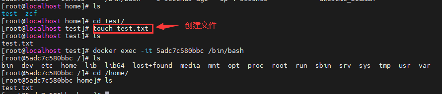

方式二：dockerfile方式进行挂载

### 4.2 匿名挂载和具名挂载

~~~ shell
# 匿名挂载
-v 容器内路径
docker run -d -p --name nginx01 -v /ect/nginx nginx
# 查看所有的volume情况
docker volume ls
# 匿名挂载就是在-v时只写了容器内路径，没有写容器外路径

# 具名挂载
# -v 卷名:容器路径
docker run -d -p --name nginx01 -v juming-nginx:/ect/nginx nginx
# 查看挂载路径
docker volume inspect juming-nginx
~~~

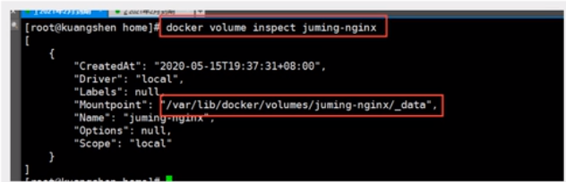

​	总结：所有docker容器内的卷，没有指定目录的情况下都在**/var/lib/docker/volums/xxxx/_data**,通过具名挂载可以方便找到一个卷，大多数情况下使用具名挂载。

~~~shell
# 如何确定是具名挂载、匿名挂载、指定路径挂载
-v 容器内路径
-v 卷名:容器内路径
-v 宿主机路径:容器内路径
~~~

### 4.3 数据卷容器

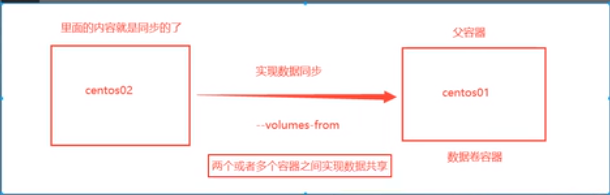

​	命令：--volumes-from

## 五、DockerFile介绍

​	概念：dockerfile用来构建docker镜像的文件，命令脚本参数。

### 5.1 构建步骤

​	1、编写dockerfile文件，使用官方提供的默认文件名(DockerFile)

​	2、docker build 构建一个镜像

​	3、docker run 镜像

​	4、docker push发布镜像

### 5.2 DockerFile构建过程

​	DcokerFile：构建文件，定义一切步骤，源代码

​	DockerImages：通过DockerFile构建生成镜像，最终发布和运行产品

​	Docker容器：容器就是镜像运行起来提供服务器

### 5.3 DockerFile指令

~~~ shell
FROM        # 基础镜像，一切从这里开始构建
MAINTAINER  # 镜像是谁写的，姓名+邮箱
RUN         # 镜像运行是需要的命令
ADD         # 添加其他程序（压缩包）
WORKDIR     # 镜像的工作目录  /bin/bash
VOLUME      # 挂载的目录位置
EXPOSE      # 暴露端口
RUN         # 运行命令
CMD         # 指定容器启动后输出的命令,只有最后一个会生效，可被替代
ENTRYPOINT  # 指定容器启动后输出的命令,可以追加命令
ONBUILD     # 当构建一个被继承DockerFile这个时候会运行ONBUILD指令
COPY        # 类似ADD命令，将文件拷贝到镜像中
ENV         # 构建的时候设置环境变量
~~~

练习：创建自己的centos

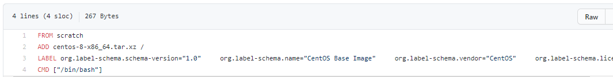

在dockerhub中大部分的镜像都是从scratch开始构建，scratch作为基础构建

~~~shell
# 1、创建DockerFile文件
FROM centos
MAINTAINER zchuanfa<zcf@linewell.com>
ENV MYPATH /usr/local
WORKDIR $MYPATH      # 设置进入容器后直接进入设置的目录
RUN yum -y install vim
EXPOSE 80
CMD echo $MYPATH
CMD /bin/bash
# 2、build镜像
docker build -f myDockerFile -t myDocker:1.0

~~~

可以通过docker history 容器ID查看容器的构建过程

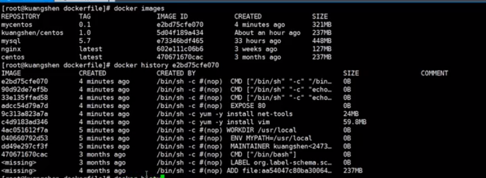

## 六、Docker网络

查看docker容器的ip信息

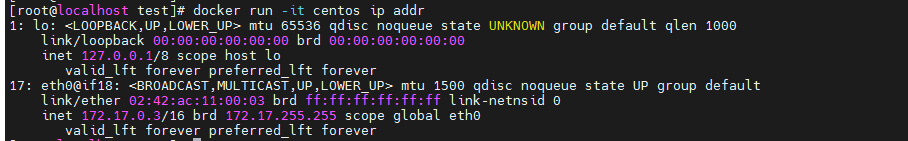

docker容器间的网络图

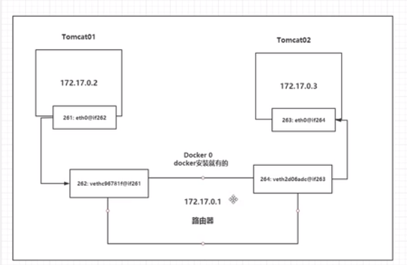

docker中所有的容器不指定网络的情况，都是docker0路由的，docker会给容器分配一个默认的ip。

### 6.2 容器互联--link

~~~shell
# 通过--link设置通气直接互联
docker run -d P --name tomcat01 --link tomcat02 tomcat
# 查看容器是否能ping得通
docker exec -it tomcat01 ping tomcat02
# --link只能单向连接，如果容器要互联需要同时设置--link
~~~

### 6.3 自定义网络

1、查看docker网络信息

~~~shell
docker network ls
~~~

2、自定义网络

~~~shell
# 自己创建网络
docker network create --driver bridge --subnet 192.168.0.0/16 --gateway 192.168.0.1 mynet
# 容器配置自己定义的网络
docker run -d -P --net mynet tomcat
~~~

结论：自定义的网络已经帮我们维护好了对应的关系，平时使用自定义的方式来使用网络。

### 6.4 网络连通

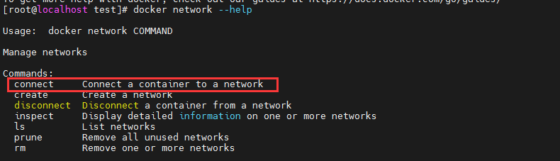

通过connect方法将容器连通到网络中

~~~ shell
# 将tomcat01连接到mynet网络
docker network connect mynet tomcat01
~~~

