# :page_with_curl: Nifi应用

## 一、Nifi简介

### 1、Nifi是什么

一个用户友好，可扩展且可靠的，专为处理数据流而诞生的，强大的数据处理工具, 把数据处理过程中可能需要经历的步骤都封装成一个个处理器，可以让我们随意搭配使用

### 2、我们用来做什么

数据梳理流程，http://192.168.60.138:8089/nifi/

### 3、术语，在overview

**FlowFile**:流文件

**Processor**：（处理器）每个组件

**Connection**：连接提供处理器之间的实际链接。它们充当队列，允许各种进程以不同的速率进行交互。这些队列可以动态地划分优先级，并且可以有负载的上限，从而实现背压。

**Flow Controller**：后台调度器 流控制器维护流程如何连接和管理所有进程使用的线程及其分配的知识。流控制器充当代理，促进处理器之间的流文件交换。

**Process Group**：进程组是一组特定的进程及其连接，可以通过输入端口接收数据，也可以通过输出端口发送数据。以这种方式，流程组允许通过组合其他组件来创建全新的组件。

几个示例流程

http://192.168.60.138:8089/nifi/?processGroupId=338a8267-0178-1000-a846-f5549c2f7eff&componentIds=

几个常用的控制服务  Controller Services

**Controller Services**:A ControllerService provides shared state and functionality across Processors, other ControllerServices, and ReportingTasks within a single JVM. An example use case may include loading a very large dataset into memory. By performing this work in a ControllerService, the data can be loaded once and be exposed to all Processors via this service, rather than requiring many different Processors to load the dataset themselves.

比如： DBCPConnectionPool，RedisConnectionPoolService

## 二、常用的组件-Processors

### 2.1、数据转换

#### 2.1.1 EncryptContent

#### 2.1.2 ReplaceText

描述：

​	使用其他值替换匹配正则表达式的流文件部分内容，从而更新流文件的内容。

属性配置：

应用场景：

​	使用正则表达式，来逐行或者全文本替换文件流内容，往往用于业务逻辑处理。

示例说明：

1、流文件内容

2、全文本替换，配置如下

​	(?s)(^.*$)匹配所有值，选择正则匹配替换，全文本替换，

结果：

3、逐行替换，配置如下

结果：

### 2.2、路由和调解：

#### 2.2.1 DistributeLoad

描述：

​    该处理器根据分发策略将流文件分发给下游处理器。如果使用循环策略，默认情况下为每个目的地分配1个权重(均匀分布)。当然，权重与 relationship都是灵活可配的，比如自定义 属性名‘5’，值‘2’，那么relationship为‘5’的权重为2

属性配置：

动态属性：

应用场景：

​     按权重向下游多个处理器分发数据。在单个流程处理数据达到瓶颈，而整体环境资源充足，这种情况有可能需要多个流程来分担数据处理压力。而该处理器充当一个分发数据的角色；（注：与connection的Load Balance要区分开）

示例说明：

​    模拟数据发送到3个处理流程中

配置信息：关系权重值越大，权重越高，分配的流文件越多

#### 2.2.2 RouteOnAttribute

描述：

​    该处理器使用属性表达式语言，根据流文件的属性去计算然后进行路由。

属性配置：

动态属性：

应用场景：

​    该处理器往往用于判断流文件属性

示例说明：

​    判断属性中多个值是否为空，不同判断结果执行不同逻辑

自定义paramError属性

~~~ html

${lastest.pkName:isEmpty():or(${lastest.pkValue:isEmpty()}):or(${lastest.tsValue:isEmpty()}):or(${lastest.tsName:isEmpty()})}
~~~

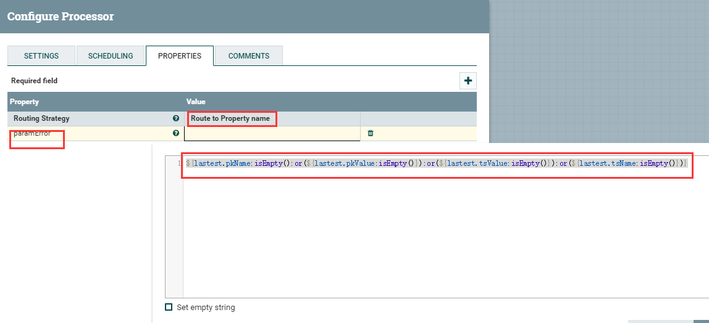

输入流属性如下，要求非空的属性中有空值：

结果如下：路由到paramError关系

#### 2.2.3 RouteOnContent

描述：

​    该处理器使用正则表达式去匹配流文件的内容，并将流文件路由到正则表达式所匹配的relation。在用户自定义的属性上添加正则表达式，其中属性的名称是关系的名称，值是一个正则表达式，用于匹配流文件内容。用户定义的属性支持属性表达式语言，但是表达式计算的结果被解释为文字值，而不是正则表达式。

属性配置：

动态属性：

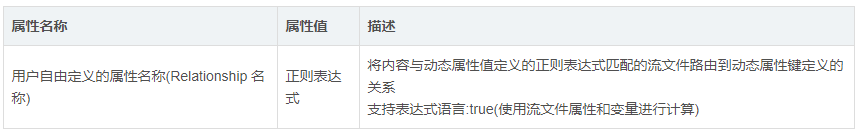

应用场景：

​    该处理器用于路由，控制流文件去向。

示例说明：

​    比如进行一次Http请求，请求返回的数据中有字符串 "success":true 表名此次请求成功

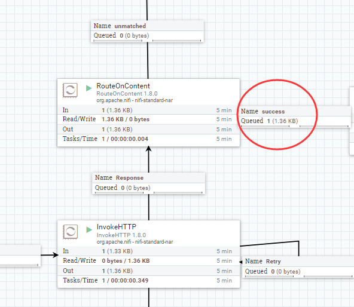

### 2.3、数据库操作：

#### 2.3.1 QueryDatabaseTable

描述：

​    生成SQL select查询，或使用提供的语句，并执行该查询以获取指定的最大值列中的值大于先前看到的最大值的所有行。查询结果将转换为Avro格式。多个属性支持表达式语言，但不允许传入连接。变量注册表可用于为包含表达式语言的任何属性提供值。如果需要利用流文件属性来执行这些查询，则可以使用GenerateTableFetch和/或ExecuteSQL处理器来实现此目的。使用流式处理，因此支持任意大的结果集。可以使用标准的调度方法，将此处理器调度为在计时器或cron表达式上运行。此处理器仅在主节点上运行。流文件属性'querydbtable.row.count'表示选择了多少行。

属性配置：属性查看官方文档

#### 2.3.2 ConvertJSONToSQL

描述：

​    将json转换成可执行的SQL；json要求为flat型的，就理解为是简单的key-value形式，没有过深的结构；json是单条，数组都可以；数组的json时，输出是若干个单条json的SQL语句；

属性配置：

JDBC Connection Pool：数据库连接池[HiveConnectionPool](http://10.167.0.4:54321/nifi-docs/components/org.apache.nifi/nifi-hive-nar/1.8.0/org.apache.nifi.dbcp.hive.HiveConnectionPool/index.html)，[DBCPConnectionPool](http://10.167.0.4:54321/nifi-docs/components/org.apache.nifi/nifi-dbcp-service-nar/1.8.0/org.apache.nifi.dbcp.DBCPConnectionPool/index.html)，DBCPConnectionPoolLookup

Statement Type：UPDATE INSERT DELETE

Table Name：表名

Catalog Name：设置为空就行；

Schema Name：看数据库类型配置，比如gp之类的就有schema

Translate Field Names：如果为真，处理器将尝试将JSON字段名转换为指定表的适当列名。如果为false, JSON字段名必须与列名完全匹配，否则不会更新列

Unmatched Field Behavior：一个字段不匹配，如何处理；可选忽略不匹配字段，或者直接报错；

Unmatched Column Behavior：所有字段都不匹配，如何处理；

Update Keys：惟一地标识数据库中用于UPDATE语句的行。如果语句类型为

UPDATE，且未设置此属性，则使用表的主键。在这种情况下，如果不存在主键，那么如果将不匹配的列行为设置为failed，那么转换到SQL的操作将失败。如果语句类型为INSERT，则忽略此属性

Quote Column Identifiers：引用列标识符；启用此选项将导致引用所有列名，允许在表中使用保留字作为列名。

Quote Table Identifiers：同上

SQL Parameter Attribute Prefix：SQL参数属性前缀，sql.args.1.value  那个sql就是前缀

Table Schema Cache Size：指定应缓存多少表架构

**注意**

​    大量数据插入，这个Processor的效率很低的，为什么这么说呢，一个流的数据如果是json，也应该是json数组，但一个json数组通过这个processor得到的结果是若干个insert语句，每一个insert语句中只有一条数据；可以改进成insert into table （）values （）（）。。。的形式；也可以使用PutDatabaseRecord 做大量数据的insert，PutDatabaseRecord的优势是内置reader，减少了流程的中间落地

#### 2.3.3 ExecuteSQL

描述：

   该处理器执行SQL语句，返回avro格式数据。处理器使用流式处理，因此支持任意大的结果集。处理器可以使用标准调度方法将此处理器调度为在计时器或cron表达式上运行，也可以由传入的流文件触发。SQL语句来源可以来自该处理器属性SQL select query，也可以来自上一个处理器的输出流（UTF-8格式）（GenerateTableFetch，ConvertJsonToSql等等生成的流内容中的SQL语句，类似于insert into。。。value  （？。。。），这个？的值是存在于流属性中的：sql.args.N.value  sql.args.N.type ，ExecuteSQL会自动装配并执行）

属性配置：

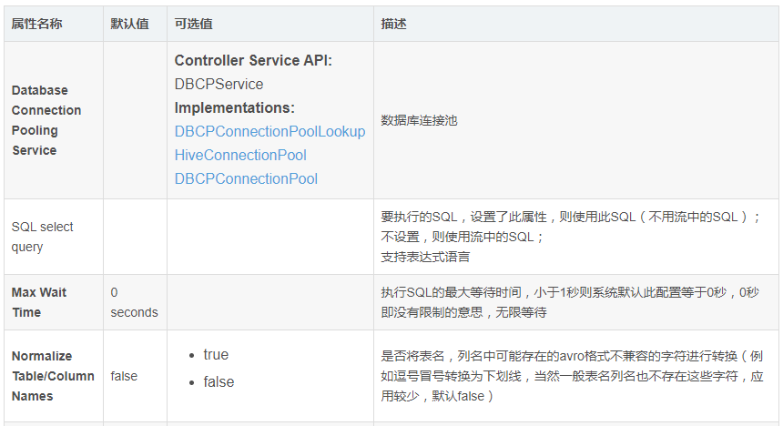

**注意：**

Max Rows Per Flow File ：每个流文件包含的数据条数；

Output Batch Size：几个流文件同时输出到下个流程；

#### 2.3.4 PutSQL

描述：

​    执行SQL更新或插入命令。传入流文件的内容应该是要执行的SQL命令。SQL命令可以使用？转义参数。在这种情况下，要使用的参数必须作为具有命名约定sql.args.N.type和sql.args.N.value的FlowFile属性存在，其中N是正整数。sql.args.N.type应该是一个表示JDBC类型的数字。流文件的内容应为UTF-8格式。

属性配置：

JDBC Connection Pool：指定要用于将JSON消息转换为SQL语句的JDBC连接池。连接池是确定适当的数据库列类型所必需的。

SQL Statement：要执行的SQL语句。语句可以是空的、常量值，也可以使用表达式语言从属性构建。如果指定了此属性，则无论传入流文件的内容如何，都将使用它。如果此属性为空，则传入流文件的内容应包含由处理器向数据库发出的有效SQL语句。

Support Fragmented Transactions：如果为true，则当此处理器使用流文件时，处理器将首先检查该流文件的fragment.identifier和fragment.count属性。如果fragment.count值大于1，则处理器将不处理任何具有该fragment.identifier的流文件，直到所有流文件都可用；此时，它将以FlowFiles的fragment.index属性指定的顺序，将具有该fragment.identifier的所有流文件作为单个事务进行处理。这提供了这些SQL语句的原子性。一旦此事务的任何语句在执行时抛出异常，此事务将回滚。当事务回滚发生时，这些流文件都不会路由到“success”。如果<Rollback On Failure>设置为true，这些流文件将保留在输入关系中。当<Rollback On Failure>设置为false时，如果这些流文件中的任何一个将路由到“retry”，则所有这些流文件都将路由到“retry”。否则，它们将路由到“Failure”。如果该值为false，这些属性将被忽略，更新将独立于其他属性进行。

Database Session AutoCommit：要在正在使用的数据库连接上设置的自动提交模式。如果设置为false，操作将显式提交或回滚（分别基于成功或失败），如果设置为true，驱动程序/数据库将处理提交/回滚。

Transaction Timeout：如果<Support Fragmented Transactions>属性设置为true，则指定在将具有该标识符的所有流文件传输到“failure”关系之前，等待特定fragment.identifier属性的所有流文件到达的时间

Batch Size：在单个事务中放入数据库的首选流文件数

Obtain Generated Keys：如果为true，则数据库自动生成的任何键都将添加到使用sql.generate.key属性生成它的流文件中。这可能会导致性能稍慢，并非所有数据库都支持。

Rollback On Failure：指定如何处理错误。默认情况下（false），如果处理流文件时发生错误，则流文件将根据错误类型路由到“失败”或“重试”关系，并且处理器可以继续处理下一个流文件。相反，您可能希望回滚当前处理的流文件并立即停止进一步的处理。在这种情况下，可以通过启用此“失败时回滚”属性来实现。如果启用，则失败的流文件将保留在输入关系中，而不会对其进行惩罚并重复处理，直到成功处理或通过其他方式删除为止。设置足够的“屈服持续时间”以避免过于频繁地重试是很重要的。

#### 2.3.5 ConvertJSONToAvro

描述：

​    该处理器根据Avro schema将JSON转换为Avro。

属性配置：

应用场景：

该处理器根据Avro schema将JSON转换为Avro。

在使用 Kite 获取 avro schema时，需要配置Hadoop配置文件；

示例说明：

1：每次只 接收一个Json数据 ，无法处理**Json数组** 。

输入json：

配置：手动配置schema 或者上下文attribute传递schema

结果：

### 2.4、属性提取：

#### 2.4.1 EvaluateJsonPath

描述：

​    该处理器根据流文件的内容计算一个或多个JsonPath表达式。这些表达式的结果被写入到FlowFile属性，或者写入到FlowFile本身的内容中，这取决于处理器的配置。通过添加用户自定义的属性来输入jsonpath，添加的属性的名称映射到输出流中的属性名称(如果目标是flowfile-attribute;否则，属性名将被忽略)。属性的值必须是有效的JsonPath表达式。“auto-detect”的返回类型将根据配置的目标进行确定。当“Destination”被设置为“flowfile-attribute”时，将使用“scalar”的返回类型。当“Destination”被设置为“flowfile-content”时，将使用“JSON”返回类型。如果JsonPath计算为JSON数组或JSON对象，并且返回类型设置为“scalar”，则流文件将不进行修改，并将路由到失败。如果所提供的JsonPath计算为指定的值，JSON的返回类型可以返回“scalar”。如果目标是“flowfile-content”，并且JsonPath没有计算到一个已定义的路径，那么流文件将被路由到“unmatched”，无需修改其内容。如果目标是“flowfile-attribute”，而表达式不匹配任何内容，那么将使用空字符串创建属性作为值，并且FlowFile将始终被路由到“matched”。

属性配置：

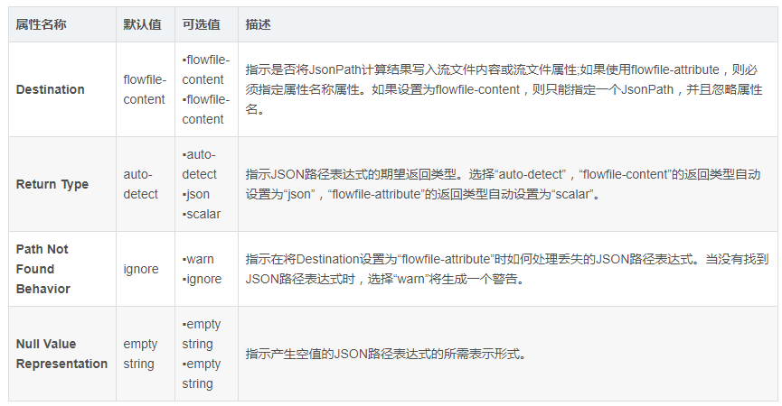

应用场景：

​    通常当需要从流文件json中提取某些数据作为流属性时，使用此处理器；或者从流文件json内容中提取一部分内容作为下一个流文件内容，使用此处理器。

示例说明：

​    1：提取流文件json内容，作为输出流的属性。（注意：当输出选择flowfile-attribute时，及时jsonpath匹配不到值，流文件也会路由到matched）

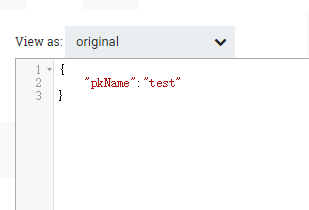

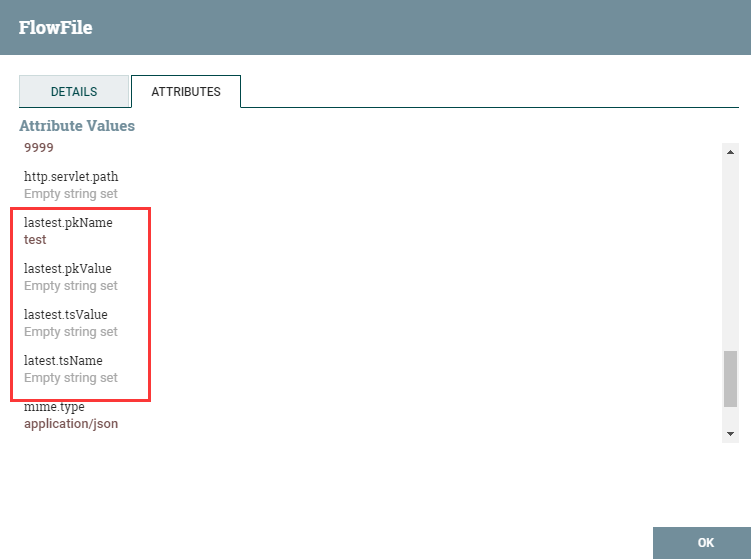

2：提取流文件json内容，作为输出流的内容。（注意：当选择flowfile-content时，用户只能自定义添加一个属性；如果jsonPath匹配不到，会路由到unmatched）

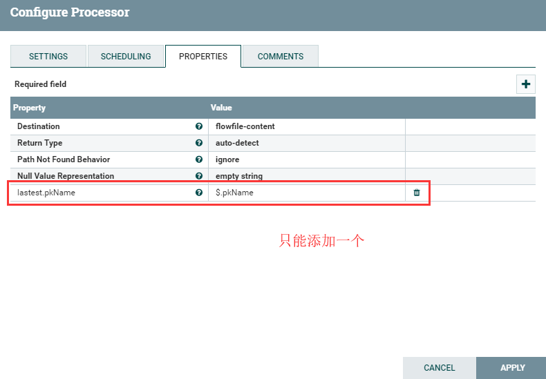

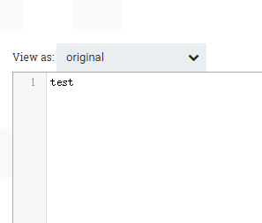

#### 2.4.2 UpdateAttribute

描述：

​    该处理器使用属性表达式语言更新流文件的属性，并且/或则基于正则表达式删除属性

属性配置：

应用场景：

该处理器基本用法最为常用，及增加，修改或删除流属性；此处理器使用用户添加的属性或规则更新FlowFile的属性。有三种方法可以使用此处理器添加或修改属性。一种方法是“基本用法”; 默认更改通过处理器的每个FlowFile的匹配的属性。第二种方式是“高级用法”; 可以进行条件属性更改，只有在满足特定条件时才会影响FlowFile。可以在同一处理器中同时使用这两种方法。第三种方式是“删除属性表达式”; 允许提供正则表达式，并且将删除匹配的任何属性。请注意，“删除属性表达式”将取代发生的任何更新。如果现有属性与“删除属性表达式”匹配，则无论是否更新，都将删除该属性。也就是说，“删除属性表达式”仅适用于输入FlowFile中存在的属性，如果属性是由此处理器添加的，则“删除属性表达式”将不会匹配到它。

示例说明：

1：基本用法增加一个属性

2：高级用法，添加规则条件，符合条件时update指定的属性值

点击ADVANCED

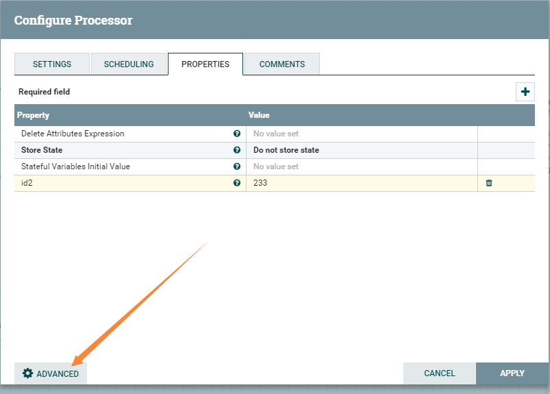

3：高级用法 存储状态,记录通过该处理器的数据流总和

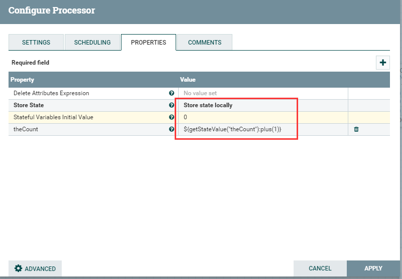

#### 2.4.3 AttributesToCSV

描述：

​    该处理器将输入流文件属性转成CSV表示形式。生成的CSV可以被写入一个名为“CSVAttributes”的新属性，也可以作为内容写入到流文件中。如果属性值包含逗号、换行符或双引号，则属性值将用双引号转义。属性值中的任何双引号字符都用另一个双引号转义。

属性配置：

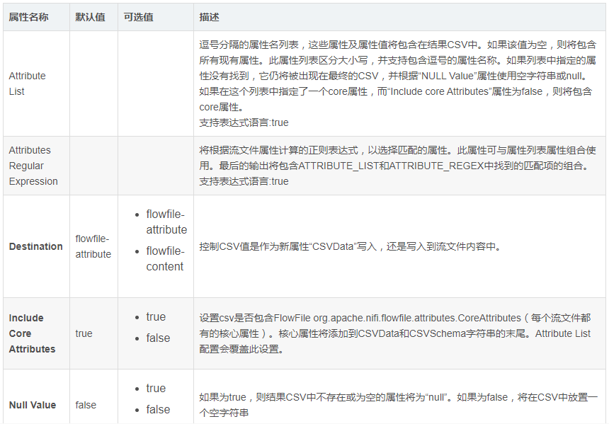

应用场景：

​    该处理器就是将流文件的若干属性转成csv数据，输出到输出流文件的属性或者内容当中 。

示例说明：

1：如图为GenerateFlowFile生成的流文件，AttributesToCSV配置csv输出到流属性中，csv包含核心属性 ，包含schema

配置如下：

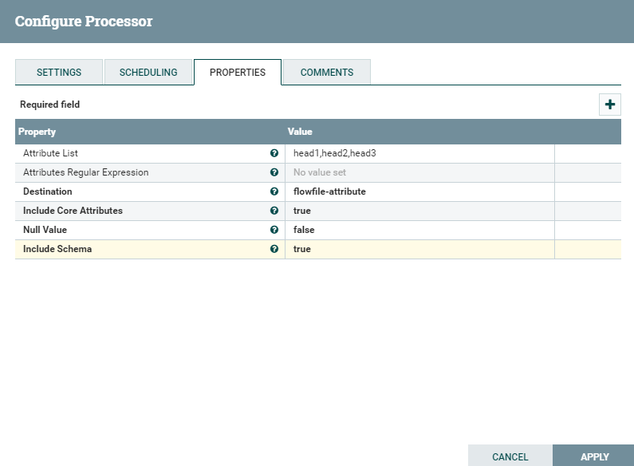

结果为(AttributesToCSV的数据流属性)：

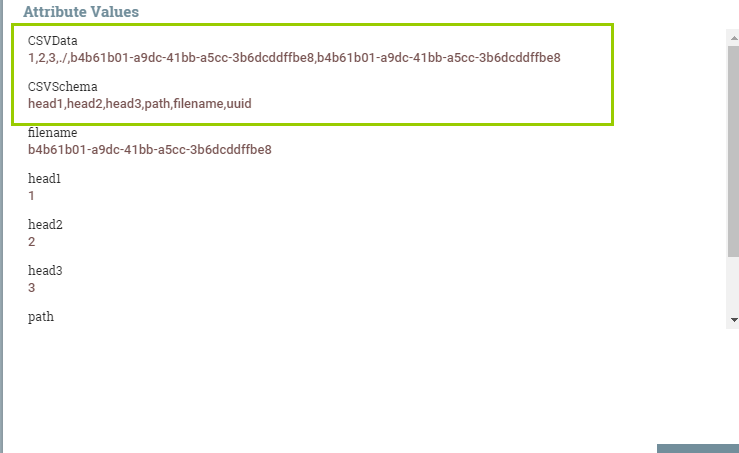

2：例子1中同样的配置，但输出到输出流的content中

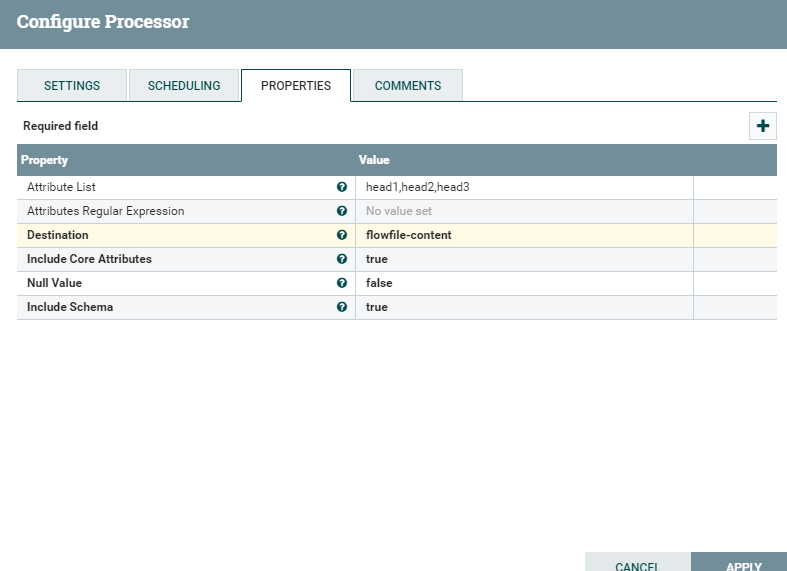

结果为：

#### 2.4.4 AttributesToJSON

描述：

​    该处理器将输入流文件属性转成JSON表示形式。生成的JSON可以被写入一个名为“JSONAttributes”的新属性，也可以作为内容写入到流文件中。

属性配置：

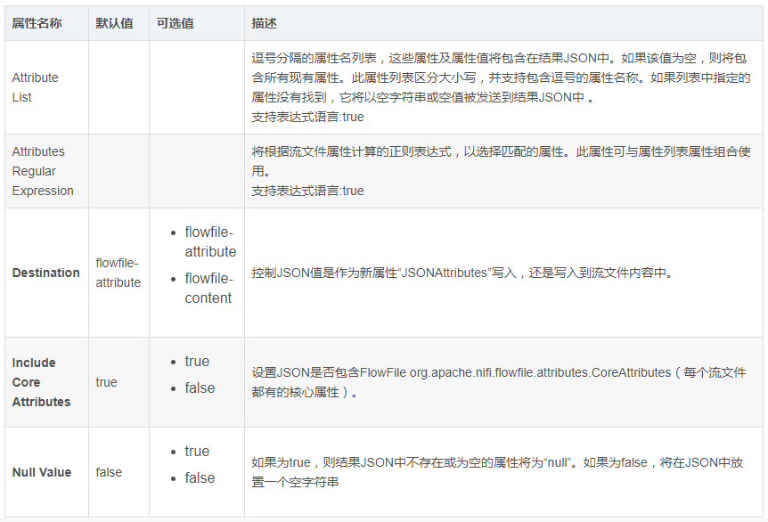

应用场景：

​    该处理器就是将流文件的若干属性转成JSON数据，输出到输出流文件的属性或者内容当中 。

示例说明：

1：如图为GenerateFlowFile生成的流文件，AttributesToJSON配置json输出到流属性中，包含核心属性

配置如下：

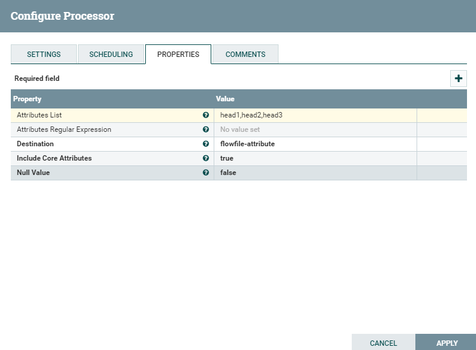

结果为：

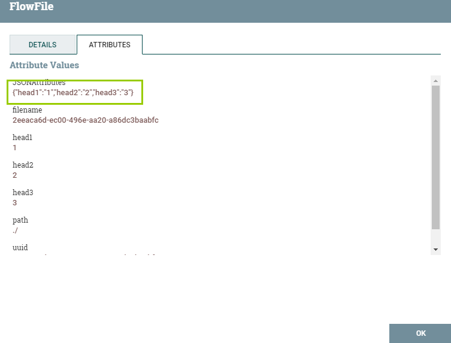

2：例子1中同样的配置，但json输出到输出流的content中

结果：

### 2.5、系统交互：

- 目前没用

### 2.6、数据摄取：

#### 2.6.1 GET

#### 2.6.2 ConsumeKafka

描述：

​    Kafka消费程序

#### 2.6.3 ScrollElasticsearchHttp

描述：

​    拉起ES数据

### 2.7、数据出口/发送数据:

#### 2.7.1 PUT

#### 2.7.2 PutKafka

### 2.8、拆分和聚合:

#### 2.8.1 SplitJson

描述：

​    该处理器使用JsonPath表达式指定需要的数组元素，将JSON数组分割为多个单独的流文件。每个生成的流文件都由指定数组的一个元素组成，并传输到关系“split”，原始文件传输到关系“original”。如果没有找到指定的JsonPath，或者没有对数组元素求值，则将原始文件路由到“failure”，不会生成任何文件。

属性配置：

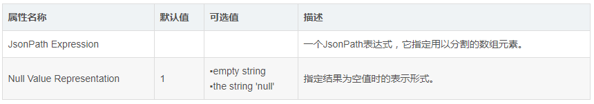

应用场景：

​    该处理器主要用于分割json数组，灵活运用时也可做数据清洗(比如需要抽取json中某一个字段)。

示例说明：

1:下面是该处理器应用最多的情况，如下图为一json数组

在SplitJson中配置JsonPath为 $.* (匹配数组任意元素)

split关系中输出3个分割文件，original关系中输出被分割原文件。

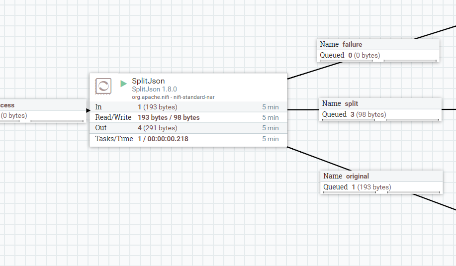

2：举例说明该处理器的复杂使用，如下图为一多层次结构json数组，需要分割取出json数组中的father字段。

配置JsonPath为$.*.family.father

结果：

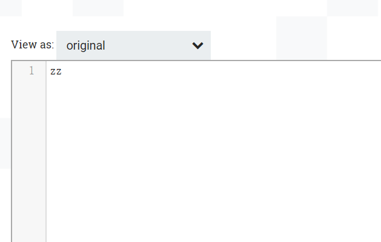

#### 2.8.2 MergeRecord

描述：

​    此处理器将多个面向记录的流文件合并到一个包含输入流文件所有记录的流文件中。这个处理器的工作原理是创建“文件箱”，然后将流文件添加到这些文件箱中，直到它们满为止。一旦一个箱子满了，所有的流文件将合并成一个输出流文件，并且该流文件将被路由到“合并”关系。一个垃圾箱可能由许多“like flowfile”组成。为了将两个流文件视为“类似于流文件”，它们必须具有相同的架构（由记录读取器标识），并且如果设置了<Correlation Attribute Name>属性，则指定属性的值必须相同。有关详细信息，请参阅处理器用法和其他详细信息。

### 2.9、HTTP:

#### 2.9.1 GetHTTP

描述：

​    请注意，此处理器已弃用，可能会在不久的将来被删除。改用InvokeHTTP。从HTTP或HTTPS URL获取数据并将数据写入流文件的内容。一旦获取了内容，ETag和最后修改的日期就会被记住（如果web服务器支持这些概念的话）。这允许处理器仅在远程数据已更改或状态清除之前获取新数据。也就是说，一旦从给定的URL获取了内容，在远程服务器上的内容发生更改之前，不会再次获取该内容。注意，由于状态管理的限制，存储的“last modified”和etag字段永远不会过期。如果GetHttp中的URL使用的表达式语言是无界的，则可能会发生内存不足错误。

#### 2.9.2 ListenHTTP

描述：

​    启动HTTP服务器并侦听给定的基本路径，以将传入的请求转换为流文件。服务的默认URI将是http://{hostname}:{port}/contentListener。只支持HEAD和POST请求。GET、PUT和DELETE将导致错误和HTTP响应状态代码405。在<service\u URI>/healthcheck上支持GET。如果服务可用，则返回“200ok”，内容为“OK”。可以将运行状况检查功能配置为可通过其他端口访问。有关详细信息，请参阅“健康检查请求的侦听端口”属性的文档。

#### 2.9.3 InvokeHTTP

描述：

​    可以与可配置的HTTP端点交互的HTTP客户端处理器。目标URL和HTTP方法是可配置的。FlowFile属性被转换为HTTP头，FlowFile内容作为请求的主体（如果HTTP方法是PUT、POST或PATCH）。

#### 2.9.4 PostHTTP

描述：

​    请注意，此处理器已弃用，可能会在不久的将来被删除。改用InvokeHTTP。使用流文件的内容执行HTTP Post。使用最大连接数等于可能端点数乘以并发任务配置的连接池。

### 2.10、网络服务：

- 目前没用

### 2.11、其他：

#### 2.11.1 ExecuteScript

描述：

​    实验-执行给定流文件和进程会话的脚本。脚本负责处理传入的流文件（例如，传输到SUCCESS或remove）以及由脚本创建的任何流文件。如果处理不完整或不正确，会话将回滚。实验：持续使用的影响尚未得到验证。

#### 2.11.2 AttributeRollingWindow

描述：

​    本组件在一个时间窗口内，计算每一个流经的流文件的对应的NIFI表达式，然后把这些值记录在组件的state中。在这个时间窗口内的流文件，会在流属性中记录组件处理它时一共处理了多少的流文件，NIFI表达式计算结果的总和均值。

属性配置：

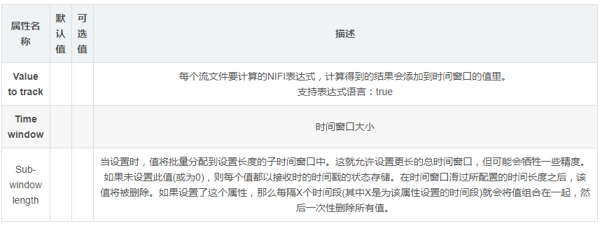

#### 2.11.3 Base64EncodeContent

描述：

​    该处理器对base64和base64之间的内容进行编码或解码

属性配置：

#### 2.11.4 LogAttribute

描述：

​    该处理器流属性输出到日志中。

属性配置：

应用场景：

​    用于输出流中的某些属性到日志中。

示例说明：

1：将某属性输出到日志当中

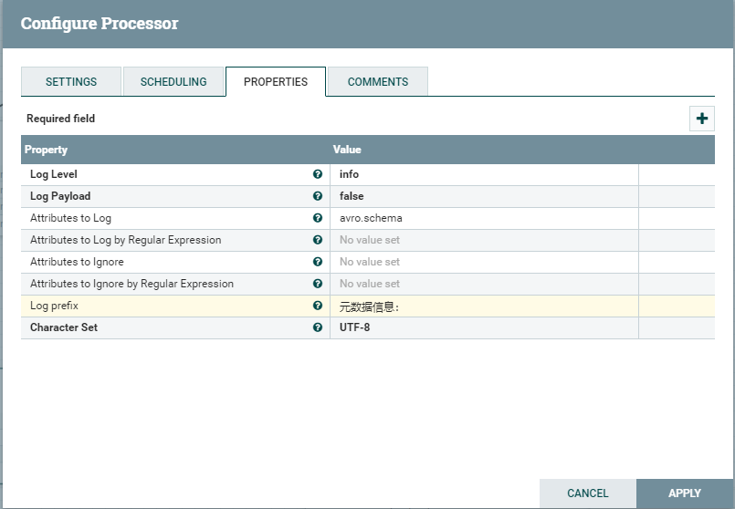

结果：

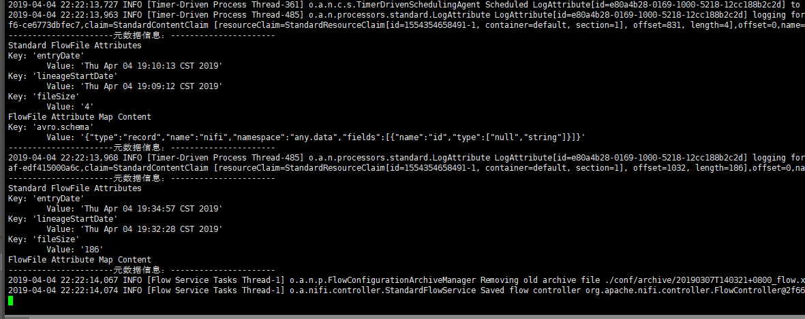

#### 2.11.5 LogMessage

描述：

​    该处理器发出指定日志级别的日志消息。

属性配置：

应用场景：

​    用于输出日志，比如一个流程处理完毕，最终的流文件可以触发此流文件，打出日志。

示例说明：

1:使用此处理器在日志中打印出流中的某个属性

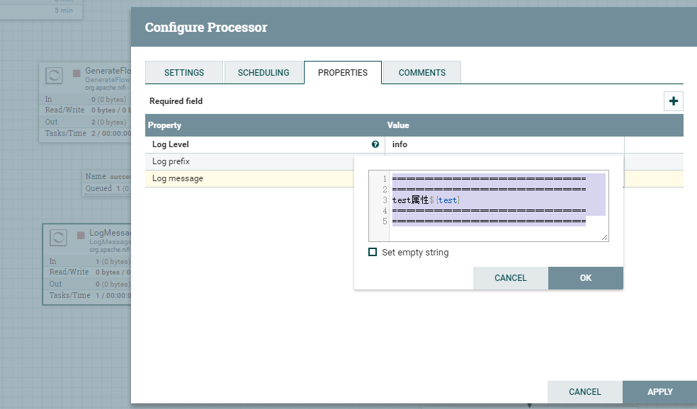

结果为：

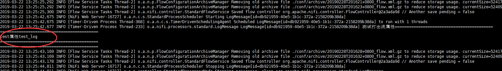

#### 2.11.6 GenerateFlowFile

描述：

​    该处理器使用随机数据或自定义内容创建流文件。GenerateFlowFile用于负载测试、配置和仿真。

属性配置：

应用场景：

该处理器多用于测试，配置生成设计人员所需要的特定数据，模拟数据来源或者压力测试、负载测试；某些场景中可以作为配置灵活使用，比如设计人员想设计一个流程查询多个表，表名就可以做出json数组配置到Custom Text，之后再使用其他相关处理器生成含有不同表名属性的多个流文件，就可以实现一个流程查询多表。(额外延伸，也可以在变量注册表、缓存保存配置，通过不同的配置读取不同的表)

示例说明：

1：该处理器生成流文件固只能作为所设计流程的第一个处理器，不允许作为其他处理器传入连接关系。

2：设置批量输出流文件，设置数据格式为Text，并且在Custom Text使用了随机数表达式。

此时每次输出10个流文件，表达式${random():mod(10):plus(1)}只执行一次，10个流文件中的文本内容是相同的。

## 三、官网介绍

地址：https://nifi.apache.org/docs.html

**general**：

- overview：概览 相关概念，架构，特性
- getting started：开始入门，安装，整体面板介绍，处理器使用，处理器分类，属性操作，使用表达式语言，模板操作，nifi监控，数据来源到结束说明页面
- user guide ：具体的每个操作的说明，比如处理器每个面板的说明，流程参数设置如何使用等
- expression language guide：所有表达式语言
- recordpath：处理数据，这个目前没用到
- Admin Guide：安装、配置、安全认证，升级等
- Toolkit Guide：工具指南，nifi工具包的指南 客户端命令等

**depveloper**:

- rest api: /nifi-api，调用nifi提供的rest接口，比如自动生成流程，在规定位置生成组件，修改组件树形等
- deveplore guide: 如何开发nifi组件，control service等，组件代码的解释等
- NiFi深入： 仓库，flowfile的生命周期，等

**Processors**

每个处理器的说明文档

**Controller Services**

控制服务

**Reporting Tasks**

报告任务

## 四、安装 Admin Guide

- 下载地址
- 常用参数，目录情况
- 启动等命令
- 重要的xml文件

## 五、自定义组件开发

## 六、问题处理

积压之类

模板上传下载

