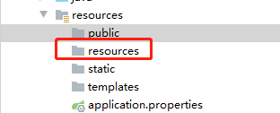

# :page_with_curl: ​Spring boot基础

## 一、Yaml配置

 ### 1、双引号和单引号的关系

​        ""双引号:不会转义字符串里面的特殊字符，特殊字符会作为本身想表达的意思

​         "name": "zhangsan \n lisi"：输出为zhangsan 换行 lisi

​       ''单引号：会转义特殊字符，字符串最终只是一个普通的字符串数据

​       "name": "zhangsan \n lisi"：输出为zhangsan \n lisi 

### 2、数组元素（list、set）,两种表示方法

 ~~~ yaml
pets1: 
   - cat
   - dog
   - pig
pets2: [pig,cat,dog]
 ~~~

### 3、@Value和@ConfigurationProperties

|                | @ConfigurationProperties | @Value           |
| -------------- | ------------------------ | ---------------- |
| 功能           | 批量注入配置文件中的属性 | 单个指定属性注入 |
| 松散绑定       | 支持                     | 不支持           |
| SpEL           | 不支持                   | 支持             |
| JSR303数据校验 | 支持                     | 不支持           |
| 复杂类型封装   | 支持                     | 不支持           |

说明：

1、松散绑定，是指属性可以通过中杠和驼峰格式直接映射；last-name,lastName

2、SpEL表达式，

+ @Value("${xx.xx.xx}")，映射配置文件
+ @Value("#{20*3}"), 计算式最后映射到字段的值是60
+ @Value("true"), 布尔型

3、JSR303数据校验，@Validated标签

~~~ java
@Commponment
@ConfigurationProperties(profix = "person")
@Validates
public class person{
    // 进行字段email格式校验
    @Email
    private String email;
}
~~~

使用选择：

+ 如果是业务逻辑中获取某个配置文件的值时选择使用@Value
+ 如果是编写了映射类与配置文件进行映射就使用@ConfigurationProperties

### 4、@PropertySource和@ImportResource

@propertySource：加载指定的配置文件，而不通过全局配置文件（application.yml）中获取

~~~java
@Commonpent
@PropertySource(value = {"classpath:person.yml"})
public class person{
    
}
~~~

@ImportResource：导入Spring配置文件，让配置文件里的内容生效

~~~java
@ImportResource(local = {"classpath:person.xml"})
@SpringBootApplication
public class Application{
    
}
~~~

SpringBoot推荐使用@Bean对第三方主键进行注入

~~~java
/**
* @Configuration指明该对象为配置类用来替代Spring的配置文件(xx.xml)
*/
@Configuration
public class MyApplicationConfig{
    
    @Bean
    public HelloService helloService() {
        return new HelloService();
    }
}
~~~

### 5、配置文件占位符

1、随机数

~~~ java
${random.int}、${random.long}、${random.int(10)}、${random.int(1024, 3213456)}
~~~

2、占位符获取之前配置的值，如果没有可以使用冒号指定默认值

~~~ 
person.last-name=张三
person.dog.name=${person.last-name:张三}_dog
~~~

### 6、多环境配置文件配置Profile

1、多Profile文件配置

配置多个application-{profile}.properties/yml，默认使用application.properties/yml

2、Yml支持多文档块配置

在yml配置文件中用---分隔一个文档块

~~~yaml
server:
  port: 8081
spring
  profile:
    active:dev
---
server:
  port: 8082
spring:
  profiles: dev  # 开发环境
---
server:
  port: 8082
spring:
  profiles: prod # 正式环境
~~~

3、Profile文件激活方式

1、在配置文件中直接指定，spring.profile.active=dev

2、命令行方式：java -jar test.jar --spring.profile.active=dev

3、虚拟机方式：-Dspring.profile.active=dev

### 7、配置文件加载位置

Springboot启动时扫描以下位置的application.properties或者application.yml文件作为默认配置文件

-file:../config

-file:../

-classpath:../config

-classpath:../

优先级由高到低，高优先级的配置会覆盖低优先级的配置,Springboot会从这四个文件夹位置加载配置文件，形成互补配置

可以通过spring.config.location修改配置文件加载位置：

java -jar test.jar --spring.config.location=d:/config/application.properties(yml)

### 8、Springboot外部配置加载顺序

Springboot可以从以下位置加载配置，优先级由高到底，并形成互补配置

1、命令行配置

java -jar test.jar --server.port=9090

2、由jar包外到jar包内查找application.properties(yml)

### 9、自动配置

### 10、@Conditional和自动配置报告

@Conditional注解的作用是作为条件判断，使得自动配置生效

| @Conditional扩展注释            | 作用（判断是否满足当前条件）                |
| ------------------------------- | ------------------------------------------- |
| @ConditionalOnjava              | 系统的java版本是否符合要求                  |
| @ConditionalOnBean              | 容器中存在指定Bean                          |
| @ConditionalOnMissBean          | 容器中不存在指定Bean                        |
| @ConditionalOnExpression        | 满足SpEL表达式                              |
| @ConditionalOnClass             | 系统中指定的类                              |
| @ConditionalOnMissClass         | 系统中没有指定的类                          |
| @ConditionalOnSingleCandidate   | 容器中只有一个指定的Bean,或者这个bean是首选 |
| @ConditionalOnProperty          | 系统中指定的值是否有确定的值                |
| @ConditionalOnResource          | 类路径下是否有指定资源文件                  |
| @ConditionalOnWebApplication    | 当前时web环境                               |
| @ConditionalOnNotWebApplication | 当前不是web环境                             |
| @ConditionalOnJndi              | JNDI存在指定项                              |

配置类需要在一定条件下才会自动配置，可以通过打开Springboot的Debug模式来查看自动配置的类的信息

~~~ yaml
debug=true
~~~

## 二、日志配置

1、SpringBoot日志框架：slf4j抽象日志接口+logback日志实现类组合

2、SpringBoot日志框架：可以通过扩展包将log4j等日志框架实现适配slf4j接口

3、对于旧框架引用的日志框架，slf4j提供了对应的包将旧框架的日志的jar包进行替换

4、logging.file：指定输出日志文件

5、logging.path：指定输出日志的路径(项目中常用)

6、log输出级别(由低到高)

+ log.trace("");
+ log.debug("");
+ log.info("");
+ log.warn("");
+ log.error("");

7、日志指定配置

不同日志框架，在SpringBoot中定义log配置文件名称规则

| Logging System          | Customization                                                |
| ----------------------- | ------------------------------------------------------------ |
| Logback                 | `logback-spring.xml`, `logback-spring.groovy`, `logback.xml`, or `logback.groovy` |
| Log4j2                  | `log4j2-spring.xml` or `log4j2.xml`                          |
| JDK (Java Util Logging) | `logging.properties`                                         |

logbak.xml：会被日志框架直接识别

**logbak-srping.xml**：不会被日志框架直接识别，会被Spring-Boot识别，可以使用SpringBoot中使用一些高级功能，springprofile 标签

~~~xml
// 开发环境输出的日志内容
<springprofile name="dev">
 .....
</springprofile>
~~~

其他日志框架的配置文件同样使用*-spring.xml的名称规则

## 三、WEB开发

### 1、SpringBoot静态资源映射规则

~~~java
@Override
public void addResourceHandlers(ResourceHandlerRegistry registry) {
if (!this.resourceProperties.isAddMappings()) {
   logger.debug("Default resource handling disabled");
	return;
}
Duration cachePeriod =this.resourceProperties.getCache().getPeriod();
CacheControl cacheControl = this.resourceProperties.getCache().getCachecontrol().toHttpCacheControl();
if (!registry.hasMappingForPattern("/webjars/**")) {			customizeResourceHandlerRegistration(registry.addResourceHandler("/webjars/**")					.addResourceLocations("classpath:/META-INF/resources/webjars/")
.setCachePeriod(getSeconds(cachePeriod)).setCacheControl(cacheControl));
}
String staticPathPattern =this.mvcProperties.getStaticPathPattern();
if (!registry.hasMappingForPattern(staticPathPattern)) {
			customizeResourceHandlerRegistration(registry.addResourceHandler(staticPathPattern)					.addResourceLocations(getResourceLocations(this.resourceProperties.getStaticLocations()))						.setCachePeriod(getSeconds(cachePeriod)).setCacheControl(cacheControl));
 }
}
// 欢迎页
@Bean
public WelcomePageHandlerMapping welcomePageHandlerMapping(ApplicationContext applicationContext,
				FormattingConversionService mvcConversionService, ResourceUrlProvider mvcResourceUrlProvider) {
			WelcomePageHandlerMapping welcomePageHandlerMapping = new WelcomePageHandlerMapping(
					new TemplateAvailabilityProviders(applicationContext), applicationContext, getWelcomePage(),
					this.mvcProperties.getStaticPathPattern());
			welcomePageHandlerMapping.setInterceptors(getInterceptors(mvcConversionService, mvcResourceUrlProvider));
			welcomePageHandlerMapping.setCorsConfigurations(getCorsConfigurations());
			return welcomePageHandlerMapping;
}
~~~

1.所有webjars/**都去classpath:/META-INF/resources/webjars/找资源

webjars：以jar包的形式引入静态资源（已经将第三方前端插件封装成jar，用mevean进行依赖）

依赖包地址：https://www.webjars.org/

~~~xml
<dependency>
    <groupId>org.webjars</groupId>
    <artifactId>jquery</artifactId>
    <version>3.3.1</version>
</dependency>
~~~

2./**访问当前项目的任何资源。（静态资源）

~~~xml
"classpath:/META-INF/resources/",
"classpath:/resources/",
"classpath:/static/",
"classpath:/public/"
~~~

对应的文件目录结构

3.欢迎页：静态资源目录下的所有index.html页面，被/**映射：

 	localhost:8080/ 找到index页面

4.所有的**/favicon.ico都在静态资源目录下找，favicon.ico是指菜单栏图标

5.Spring Boot修改静态资源路径

spring.resources.static-locations=classpath:/hello/

### 2、SpringBoot MVC自动配置（WebMvcAutoConfiguration）

https://docs.spring.io/spring-boot/docs/2.1.17.RELEASE/reference/html/boot-features-developing-web-applications.html

Spring Boot 自动配置好了Spring MVC.

以下是SpringBoot的Spring MVC默认配置:

- Inclusion of `ContentNegotiatingViewResolver` and `BeanNameViewResolver` beans.

  自动配置了ViewResolver（视图解析器，通过方法返回值得到对应的View对象）

  `ContentNegotiatingViewResolver` ：组合所有的视图解析器

- Support for serving static resources, including support for WebJars (covered [later in this document](https://docs.spring.io/spring-boot/docs/2.1.17.RELEASE/reference/html/boot-features-developing-web-applications.html#boot-features-spring-mvc-static-content))).

  静态资源文件夹路径，WebJars

- Static `index.html` support. 静态首页访问

- Custom `Favicon` support (covered [later in this document](https://docs.spring.io/spring-boot/docs/2.1.17.RELEASE/reference/html/boot-features-developing-web-applications.html#boot-features-spring-mvc-favicon)). 

  静态资源favicon.ico

  

- 自动注册 `Converter`, `GenericConverter`, and `Formatter` beans.

  `Converter`：类型转换器

  `Formatter` ：格式化器（日期格式化）

- Support for `HttpMessageConverters` (covered [later in this document](https://docs.spring.io/spring-boot/docs/2.1.17.RELEASE/reference/html/boot-features-developing-web-applications.html#boot-features-spring-mvc-message-converters)).

  HttpMessageConverter：SpringMVC用来转换Http请求和相应

  自己给容器中添加HttpMessageConverter，只需要将自己的组件注册到容器中（**@Bean,@Component**）

- Automatic registration of `MessageCodesResolver` (covered [later in this document](https://docs.spring.io/spring-boot/docs/2.1.17.RELEASE/reference/html/boot-features-developing-web-applications.html#boot-features-spring-message-codes)).

  MessageCodesResolver：定义错误代码配置类

- Automatic use of a `ConfigurableWebBindingInitializer` bean (covered [later in this document](https://docs.spring.io/spring-boot/docs/2.1.17.RELEASE/reference/html/boot-features-developing-web-applications.html#boot-features-spring-mvc-web-binding-initializer)).

### 3、SpringBoot MVC扩展配置

If you want to keep Spring Boot MVC features and you want to add additional [MVC configuration](https://docs.spring.io/spring/docs/5.1.18.RELEASE/spring-framework-reference/web.html#mvc) (interceptors, formatters, view controllers, and other features), you can add your own `@Configuration` class of type `WebMvcConfigurer` but **without** `@EnableWebMvc`. If you wish to provide custom instances of `RequestMappingHandlerMapping`, `RequestMappingHandlerAdapter`, or `ExceptionHandlerExceptionResolver`, you can declare a `WebMvcRegistrationsAdapter` instance to provide such components.

If you want to take complete control of Spring MVC, you can add your own `@Configuration` annotated with `@EnableWebMvc`.

**编写一个配置类@Configuration，实现WebMvcConfigurer重写相应的方法，不要添加`@EnableWebMvc`注解**，即保留SpringBoot默认配置，也包含自己的配置

~~~java
@Configuration
public class MyConfig implements WebMvcConfigurer {
    @Override
    public void addViewControllers(ViewControllerRegistry registry) {
        // 效果浏览器发送/hello请求，返回成功页面
        registry.addViewController("/hello").setViewName("success");
    }
}

~~~

**@EnableWebMvc：全部取消SpringBoot相关MVC自动配置。**

### 3、如何修改SpringBoot的默认配置

模式：

1)、SpringBoot在自动配置组件的时候，先判断容器中有没有存在用户自己创建的组件（@Bean,@Component）,如果没有才会自动配置；如果有些组件可以有多个组件，将用户配置和自己默认的组合起来使用。**用户如果要自定义组件直接注入到容器中即可。**

2）、SpringBoot提供了很多xxxConfigure提供自定义配置

3）、SpringBoot提供了很多xxxCustomizer帮助我们进行定制配置

### 4、配置嵌入式Servlet容器

SpringBoot默认使用tomcat作为嵌入式Servlet容器

1、如何定制和修改Servlet容器的配置

1）、修改和server有关的配置(ServerProperties),对于不同容器也可以进行特殊配置

~~~yaml
server.port=9080
// 对不同容器进行特殊化配置
server.tomcat.xxx=xxx
~~~

2)、编写一个**WebServerFactoryCustomizer**，嵌入到Servlet容器的定制器；来修改Servlet容器的配置

### 5、注册Servlet、Filter、Listener

ServletRegistrationBean

~~~java
// 注册自己的Servlet,设置拦截路径
@Bean
public ServletRegistrationBean myServlet() {
   ServletRegistrationBean registrationBean = new        ServletRegistrationBean(new MyServlet(), "/hello");
   return registrationBean;
}
~~~

FilterRegistrationBean

~~~java
@Bean
public FilterRegistrationBean myFilter() {
      FilterRegistrationBean registrationBean = new FilterRegistrationBean();
    // 设置过滤器
    registrationBean.setFilter(new MyFilter()); 
  // 设置过滤地址
  registrationBean.setUrlPatterns(Arrays.asList("/hello","/curd"));
     return registrationBean;
}
~~~

ServletListenerRegistrationBean

~~~java
@Bean
public ServletListenerRegistrationBean myListener() {
    ServletListenerRegistrationBean registrationBean = new ServletListenerRegistrationBean();
    // 注册自己厂家的监听器
      registrationBean.setListener(new MyListener());
    return registrationBean;
}

~~~